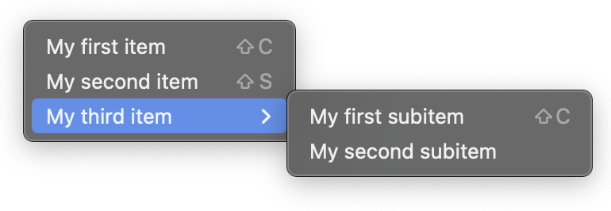

# Tauri Plugin Context Menu

A Tauri plugin to display native context menu on Tauri v1.x.
The Tauri API does not support native context menu out of the box, so this plugin is created to fill the gap.



Official context menu support has been added in Tauri v2.x (see [here](https://github.com/tauri-apps/tauri/issues/4338)), so this plugin is intended to be used with Tauri v1.x only.

## Support
| Windows | MacOS | Linux |
| ------- | ----- | ----- |
| ✅      | ✅    | ✅    |

## Installation
Crate: https://crates.io/crates/tauri-plugin-context-menu

`cargo add tauri-plugin-context-menu` to add the package.

Or add the following to your `Cargo.toml` for the latest unpublished version (not recommanded).

```toml
tauri-plugin-context-menu = { git = "https://github.com/c2r0b/tauri-plugin-context-menu", branch = "main" }
```

See ["Using a Plugin" Tauri official guide](https://tauri.app/v1/guides/features/plugin#using-a-plugin) to initialize the plugin.

This project provides a typescript utility to simplify the usage of the plugin. Run the following to install the JavaScript/TypeScript package:
    
```bash
 npm i tauri-plugin-context-menu
```

## Run Example
A vanilla JS example is provided in `examples/vanilla`.  
After `npm install`, to run the example use the following command:

```bash
npm run examples/vanilla
```

A typescript example using the utility package is provided in `examples/ts-utility` instead. You can run it with the same command as above (replace `examples/vanilla` with `examples/ts-utility`).

## Sample Usage
### Without the JS/TS Package
```ts
import { invoke } from "@tauri-apps/api";
import { listen } from "@tauri-apps/api/event";
import { resolveResource } from "@tauri-apps/api/path";

// Listen to the event emitted when the first menu item is clicked
listen("item1clicked", (event) => {
    alert(event.payload);
});

window.addEventListener("contextmenu", async (e) => {
    e.preventDefault();
    const iconUrl = await resolveResource('assets/16x16.png');

    // Show the context menu
    invoke("plugin:context_menu|show_context_menu", {
        items: [
            {
                label: "Item 1",
                disabled: false,
                event: "item1clicked",
                payload: "Hello World!",
                shortcut: "ctrl+M",
                icon: {
                    path: iconUrl
                },
                subitems: [
                    {
                        label: "Subitem 1",
                        disabled: true,
                        event: "subitem1clicked",
                    },
                    {
                        is_separator: true,
                    },
                    {
                        label: "Subitem 2",
                        disabled: false,
                        checked: true,
                        event: "subitem2clicked",
                    }
                ]
            }
        ],
    });
});
```

### With the JS/TS Package
```ts
import { showMenu } from "tauri-plugin-context-menu";

showMenu({ 
    pos: {...} // Position of the menu (see below for options)
    items: [
        ...,
        {
            ..., // Menu item (see below for options)
            event: () => {
                // Do something
            }
        }
    ]
});
```
You can also use it to respond to window events with the `onEventShowMenu` function:
```ts
import { onEventShowMenu } from "tauri-plugin-context-menu";
onEventShowMenu("contextmenu", (e) => ({ /* menuOptions */ }));
```

## Options
List of options that can be passed to the plugin.
| Option | Type | Description |
| ------ | ---- | ----------- |
| items | `MenuItem[]` | List of menu items to be displayed. |
| pos | `Position` | Position of the menu. Defaults to the cursor position. |

### MenuItem
| Option | Type | Optional | Default | Description | JS/TS pkg |
| ------ | ---- |---- |---- | ----------- | ----------- |
| label | `string` | | | Displayed test of the menu item. ||
| disabled | `boolean` | `optional` |  `false` | Whether the menu item is disabled. |
| event | `string` | `optional` | | Event name to be emitted when the menu item is clicked. | You can pass a function to be executed instead of an event name. |
| payload | `string` | `optional` | | Payload to be passed to the event. | You can pass any type of data. |
| checked | `boolean` | `optional` | | Whether the menu item is checked. |
| subitems | `MenuItem[]` | `optional` |  `[]` | List of sub menu items to be displayed. |
| shortcut | `string` | `optional` | | Keyboard shortcut displayed on the right. |
| icon | `MenuItemIcon` | `optional` | | Icon to be displayed on the left. |
| is_separator | `boolean` | `optional` | `false` | Whether the menu item is a separator. |


### MenuItemIcon
| Option | Type | Optional | Default | Description | JS/TS pkg |
| ------ | ---- |---- |---- | ----------- | ----------- |
| path | `string` | | | Absolute path to the icon file. | You can use `assetToPath` to convert a relative path to an absolute path. |
| width | `number` | `optional` | `16` | Width of the icon. |
| height | `number` | `optional` | `16` | Height of the icon. |

### Position
Position coordinates must be relative to the currently active window when `is_absolute` is set to `false`.
| Option | Type | Optional | Default | Description |
| ------ | ---- |---- |---- | ----------- |
| x | `number` | | | X position of the menu. |
| y | `number` | | | Y position of the menu. |
| is_absolute | `boolean` |`optional` | `false` |  Is the position absolute to the screen. |

### Modifier Keys
Modifier keys can be used in the `shortcut` option of a menu item to display the corresponding symbol (`⌘`, `⌃`, `⌥`, `⇧`).

On MacOS this also makes the shortcut work when the modifier key is pressed (since it is handled by default by the OS).

<details>
  <summary>Key codes list</summary>
  
  #### Modifiers  
  - `cmd`
  - `cmd_or_ctrl` (Alias for `cmd` and `ctrl`)
  - `shift`
  - `alt`
  - `ctrl`
  - `opt` (Alias for `alt`)
  - `altgr`
  - `super`
  - `win`
  - `meta`

  #### Keys
  - `plus`
  - `space`
  - `tab`
  - `capslock`
  - `numlock`
  - `scrolllock`
  - `backspace`
  - `delete`
  - `insert`
  - `return`
  - `enter`
  - `up`
  - `down`
  - `left`
  - `right`
  - `home`
  - `end`
  - `pageup`
  - `pagedown`
  - `escape`
  - `esc`
  - `num0...9`
  - `numdec`
  - `numadd`
  - `numsub`
  - `nummult`
  - `numdiv`
  - `f1...24`
</details>

## Events
### Item Clicked
Emitted when a menu item is clicked. The event name is the same as the `event` option of the menu item:

```ts
import { listen } from "@tauri-apps/api/event";
import { invoke } from "@tauri-apps/api";

listen("[EVENTNAME]", () => {
    alert("menu item clicked");
});

invoke(...{
    items: [{
        ...
        event: "[EVENTNAME]",
        ...
    }]
});
```

### Menu Did Close
Emitted when the menu is closed. This event is emitted regardless of whether the menu is closed by clicking on a menu item or by clicking outside the menu.  
You can catch this event using the following code:

```ts
import { listen } from "@tauri-apps/api/event";

listen("menu-did-close", () => {
    alert("menu closed");
});
```
